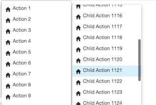

# Introduction

I decided to create this component because at that time I could't find any single available free 
component for a context menu which instead of endlessly growing uses a scrolling for any level of opened sub-menu.

The component itself is built by using React and includes a dependency on react-bootstrap which mitigate 
the work with popup positioning.
 